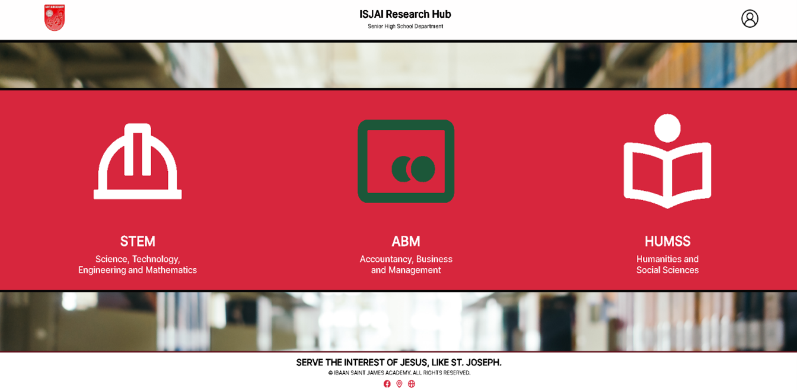
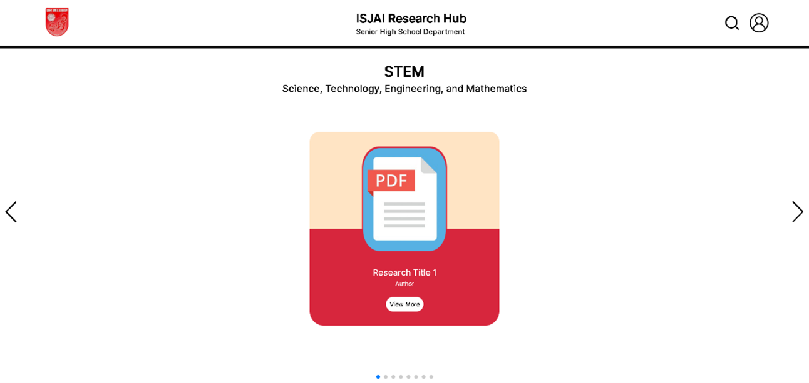
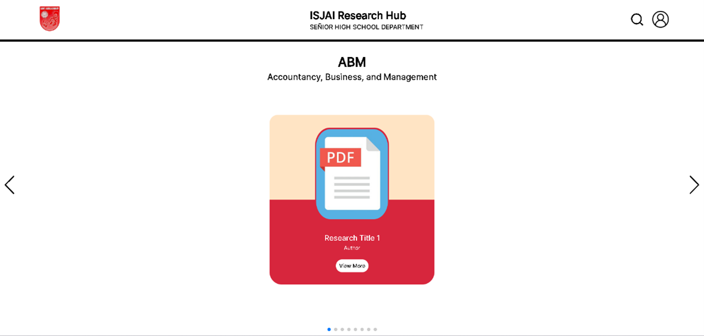
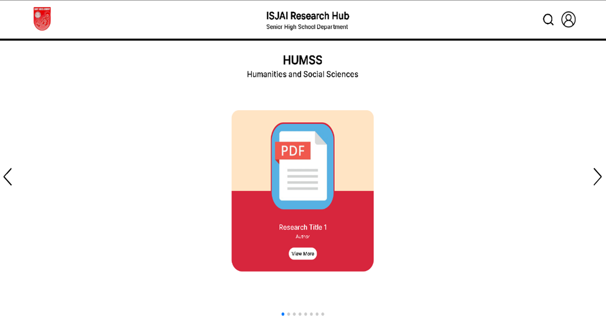

ARCHIVING RESEARCH HUB SYSTEM FOR SENIOR HIGH SCHOOL STUDENTS IN IBAAN SAINT JAMES ACADEMY, INC.

FINAL PROJECT:
IT 311 - System Administration and Maintenance  
IT 312 - System Integration and Architecture  
IT 313 - Sytem Analysis and Design  
IT 314 - Web Systems and Technologies  
BSIT - 3107

Members:
1. Acosta, Hans Rafael B. | Member Grade: 24% - System and Web Design, and Data Entry  
2. De Castro, Mark Rafael V. | Member Grade: 30% - Back-End Development  
3. De Villa, Jefferson A. | Member Grade: 16% - Data Entry and Documentation  
4. Maralit, Chris Jerald G. | Member Grade: 30% - Front-End Development, Back-End Development and Documentation  

Project Summary:  
    The sole purpose of this project is to provide a dedicated space for students to view research documents, collaborate with other students and enhance their critical thinking, problem-solving, and analytical skills. Our goal is to encourage innovation and the exploration of diverse fields of study, empowering students to become lifelong learners and proactive contributors to the world of knowledge. Align with the SDG (Sustainable Development Goals) for this system, **SDG No.4 – Quality Education**. This is to ensure inclusive and equitable quality education and promote lifelong learning opportunities for all. On a broad perspective, all SDG’s can also be aligned for it supports all manuscripts involved in their practical research.

Technologies Used:  
Software: Web Browsers: Google Chrome, Brave, and Opera GX   
IDE: Visual Studio Code (VSC)  
Back-End Server: XAMPP Server PHP MyAdmin   
Hardware: Desktop Computer, Laptop and peripherals

Student Homapage GUI:  
  
  
  
  
  
